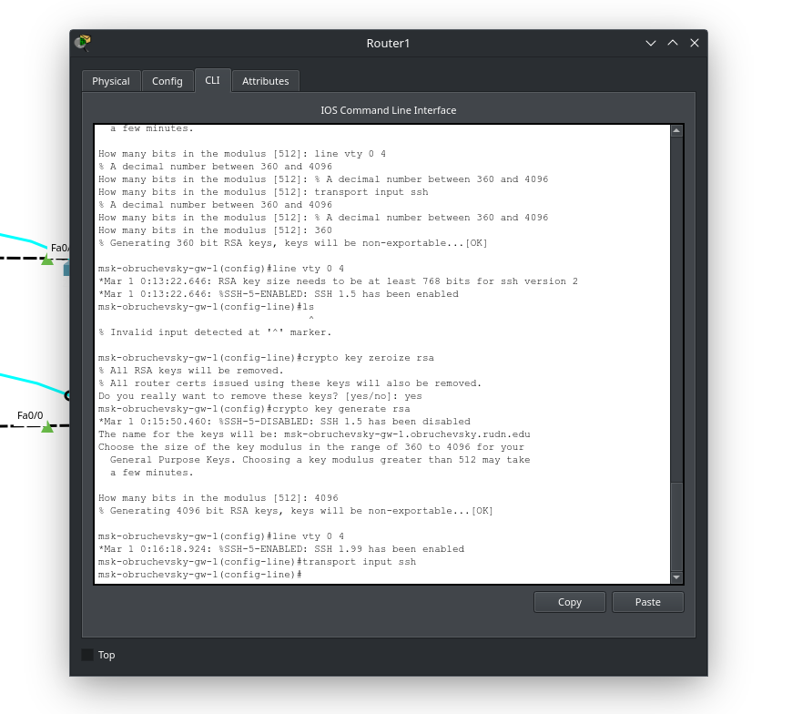
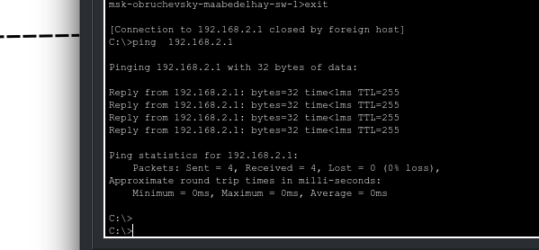

---
## Front matter
lang: ru-RU
title: Лабораторная работа № 2
subtitle: Предварительная настройка оборудования Cisco
author:
  - Абд эль хай М.
institute:
  - Российский университет дружбы народов, Москва, Россия
date: 024 февраля 2024
mainfont: "Times New Roman" 
## i18n babel
babel-lang: russian
babel-otherlangs: english

## Formatting pdf
toc: false
toc-title: Содержание
slide_level: 2
aspectratio: 169
section-titles: true
theme: metropolis
header-includes:
 - \metroset{progressbar=frametitle,sectionpage=progressbar,numbering=fraction}
 - '\makeatletter'
 - '\beamer@ignorenonframefalse'
 - '\makeatother'
---

<!-- # Информация

## Докладчик

:::::::::::::: {.columns align=center}
::: {.column width="70%"}

  * Кулябов Дмитрий Сергеевич
  * д.ф.-м.н., профессор
  * профессор кафедры прикладной информатики и теории вероятностей
  * Российский университет дружбы народов
  * [kulyabov-ds@rudn.ru](mailto:kulyabov-ds@rudn.ru)
  * <https://yamadharma.github.io/ru/>

:::
::: {.column width="30%"}

:::
:::::::::::::: -->

# Цель работы

## Цель работы

Получить основные навыки по начальному конфигурированию оборудования Cisco.

# Задание

## Настройку маршрутизатора

- задать имя в виде «город-территория-учётная_записьтип_оборудования-номер»;
- задать интерфейсу Fast Ethernet с номером 0 ip-адрес 192.168.1.254 и маску 255.255.255.0, затем поднять интерфейс;
- задать пароль для доступа к привилегированному режиму (сначала в открытом виде, затем — в зашифрованном);

## Настройку коммутатора

- задать имя в виде «город-территория-учётная_запись-тип_оборудования-номер» 
- задать интерфейсу vlan 2 ip-адрес 192.168.2.1 и маску 255.255.255.0, затем поднять интерфейс;
- привязать интерфейс Fast Ethernet с номером 1 к vlan 2;
- задать в качестве адреса шлюза по умолчанию адрес 192.168.2.254;

# Выполнение лабораторной работы

## Схема

- В логическом рабочем пространстве Packet Tracer я разместил коммутатор, маршрутизатор и 2 конечных точки ПК, подключил один ПК к маршрутизатору, другой ПК к коммутатору.

{#fig:001 width=90%}

# Конфигурация маршрутизатора

## Конфигурация маршрутизатора 1/6

Установка имени хоста
Команда: имя хоста msk-obruchevsky-gw-1
Эта команда устанавливает имя хоста маршрутизатора «msk-obruchevsky-gw-1».

{#fig:002 width=90%}

## Конфигурация маршрутизатора 2/6

Настройка интерфейса f0/0
Команды:
  - interface f0/0
  - no shutdown
  - ip address 192.168.1.254 255.255.255.0
Эти команды включают интерфейс f0/0 и назначают этому интерфейсу IP-адрес 192.168.1.254 с маской подсети 255.255.255.0.

Эти команды устанавливают пароли для виртуального терминала (VTY) и линий консоли, включают секрет для привилегированного режима, шифруют пароли и создают пользователя «admin» с уровнем привилегий 1 и паролем «adminpassword».

## Конфигурация маршрутизатора 3/6

:::::::::::::: {.columns align=center}
::: {.column width="40%"}

Эти команды задают имя домена, генерируют пару ключей RSA для шифрования и настраивают SSH в качестве транспортного входа для линий VTY.

:::
::: {.column width="60%"}

{#fig:003 width=90%}

:::
::::::::::::::

## Конфигурация маршрутизатора 4/6

{#fig:004 width=90%}

## Конфигурация маршрутизатора 5/6

я подключился к роутеру через SSH

{#fig:005 width=90%}

## Конфигурация маршрутизатора 6/6

Затем я настроил vty 1 на использование telnet и подключился от PC0 к маршрутизатору с помощью telnet.

{#fig:006 width=90%}

# Конфигурация коммутатора

## Конфигурация коммутатора 1/7

### Установка имени хоста 

Команда hostname msk-obruchievsky-sw-1 устанавливает имя хоста коммутатора на «msk-obruchevich-sw-1».

### Настройка интерфейса VLAN

Команды в интерфейсе vlan2 и интерфейсе f0/1 настраивают интерфейс VLAN и режим порта коммутатора для доступа.

### Настройка IP-адреса и шлюза по умолчанию

Команды ip адрес 192.168.2.1 255.255.255.0 и ip default-gateway 192.168.2.254 назначают IP-адреса интерфейсам и устанавливают шлюз по умолчанию для коммутатора.

## Конфигурация коммутатора 2/7

### Настройка линий доступа и шифрования

Команды, относящиеся к строке vty 0 4, строке консоли 0, включению секрета, шифрованию паролей службы, имени пользователя, имени домена IP, генерации криптографического ключа rsa и входному транспортному протоколу ssh, настраивают линии доступа, включают шифрование паролей, создают пользователя. с определенными привилегиями, настройкой доменного имени, созданием пары ключей RSA для шифрования и указанием SSH в качестве входного транспортного сигнала для безопасного доступа.
     
## Конфигурация коммутатора 3/7

{#fig:007 width=90%}

## Конфигурация коммутатора 4/7

{#fig:08 width=90%}

## Конфигурация коммутатора 5/7

{#fig:009 width=90%}

## Конфигурация коммутатора 6/7

{#fig:010 width=90%}

## Конфигурация коммутатора 7/7

{#fig:011 width=50%}

# Выводы

## Выводы
Я научился настраивать коммутатор и маршрутизатор и получать удаленный доступ через SSH/Telnet. 
