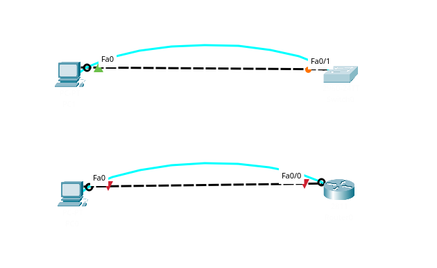
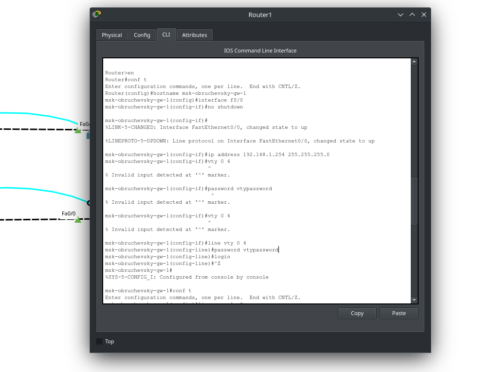
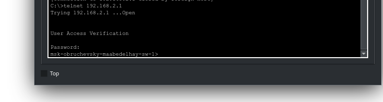
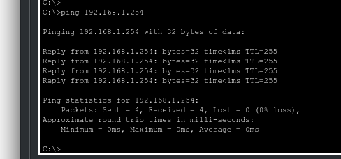

---
## Front matter
title: "Лабораторная работа № 2"
subtitle: "Предварительная настройка оборудования Cisco"
author: "Абд эль хай Мохамад"

## Generic otions
lang: ru-RU
toc-title: "Содержание"

## Bibliography
bibliography: bib/cite.bib
csl: pandoc/csl/gost-r-7-0-5-2008-numeric.csl

## Pdf output format
toc: true # Table of contents
toc-depth: 2
lof: true # List of figures
lot: false # List of tables
fontsize: 12pt
linestretch: 1.5
papersize: a4
documentclass: scrreprt
## I18n polyglossia
polyglossia-lang:
  name: russian
  options:
	- spelling=modern
	- babelshorthands=true
polyglossia-otherlangs:
  name: english
## I18n babel
babel-lang: russian
babel-otherlangs: english
## Fonts
mainfont: PT Serif
romanfont: PT Serif
sansfont: PT Sans
monofont: PT Mono
mainfontoptions: Ligatures=TeX
romanfontoptions: Ligatures=TeX
sansfontoptions: Ligatures=TeX,Scale=MatchLowercase
monofontoptions: Scale=MatchLowercase,Scale=0.9
## Biblatex
biblatex: true
biblio-style: "gost-numeric"
biblatexoptions:
  - parentracker=true
  - backend=biber
  - hyperref=auto
  - language=auto
  - autolang=other*
  - citestyle=gost-numeric
## Pandoc-crossref LaTeX customization
figureTitle: "Рис."
tableTitle: "Таблица"
listingTitle: "Листинг"
lofTitle: "Список иллюстраций"
lotTitle: "Список таблиц"
lolTitle: "Листинги"
## Misc options
indent: true
header-includes:
  - \usepackage{indentfirst}
  - \usepackage{float} # keep figures where there are in the text
  - \floatplacement{figure}{H} # keep figures where there are in the text
---

# Цель работы

Получить основные навыки по начальному конфигурированию оборудования Cisco.

# Задание

1. Сделать предварительную настройку маршрутизатора:
- задать имя в виде «город-территория-учётная_записьтип_оборудования-номер» (см. пункт 2.5), например msk-donskaya-osbender-gw-1;
- задать интерфейсу Fast Ethernet с номером 0 ip-адрес 192.168.1.254 и маску 255.255.255.0, затем поднять интерфейс;
- задать пароль для доступа к привилегированному режиму (сначала в открытом виде, затем — в зашифрованном);
- настроить доступ к оборудованию сначала через telnet, затем — через ssh (используя в качестве имени домена donskaya.rudn.edu);
- сохранить и экспортировать конфигурацию в отдельный файл.

2. Сделать предварительную настройку коммутатора:
- задать имя в виде «город-территория-учётная_запись-тип_оборудования-номер» (см. пункт 2.5), например msk-donskaya-osbender-sw-1;
- задать интерфейсу vlan 2 ip-адрес 192.168.2.1 и маску 255.255.255.0, затем поднять интерфейс;
- привязать интерфейс Fast Ethernet с номером 1 к vlan 2;
- задать в качестве адреса шлюза по умолчанию адрес 192.168.2.254;
- задать пароль для доступа к привилегированному режиму (сначала в открытом виде, затем — в зашифрованном);
- настроить доступ к оборудованию сначала через telnet, затем — через ssh (используя в качестве имени домена donskaya.rudn.edu);
- для пользователя admin задать доступ 1-го уровня по паролю;
- сохранить и экспортировать конфигурацию в отдельный файл.

# Выполнение лабораторной работы

В логическом рабочем пространстве Packet Tracer я разместил коммутатор, маршрутизатор и 2 конечных точки ПК, подключил один ПК к маршрутизатору, другой ПК к коммутатору.

{#fig:001 width=90%}

## Конфигурация маршрутизатора

Установка имени хоста
     Команда: имя хоста msk-donnaya-gw-1
         Эта команда устанавливает имя хоста маршрутизатора «msk-obruchevsky-gw-1».

{#fig:002 width=90%}

Настройка интерфейса f0/0
  Команды:
    interface f0/0
    no shutdown
    ip address 192.168.1.254 255.255.255.0
Эти команды включают интерфейс f0/0 и назначают этому интерфейсу IP-адрес 192.168.1.254 с маской подсети 255.255.255.0.

Эти команды устанавливают пароли для виртуального терминала (VTY) и линий консоли, включают секрет для привилегированного режима, шифруют пароли и создают пользователя «admin» с уровнем привилегий 1 и паролем «adminpassword».

{#fig:003 width=90%}

Эти команды задают имя домена, генерируют пару ключей RSA для шифрования и настраивают SSH в качестве транспортного входа для линий VTY.

{#fig:004 width=90%}

{#fig:005 width=90%}

я подключился к роутеру через SSH

{#fig:006 width=90%}

Затем я настроил vty 1 на использование telnet и подключился от PC0 к маршрутизатору с помощью telnet.

## Конфигурация коммутатора

Установка имени хоста

     Команда hostname msk-obruchievsky-sw-1 устанавливает имя хоста коммутатора на «msk-obruchevich-sw-1».

Настройка интерфейса VLAN

     Команды в интерфейсе vlan2 и интерфейсе f0/1 настраивают интерфейс VLAN и режим порта коммутатора для доступа.

Настройка IP-адреса и шлюза по умолчанию

     Команды ip адрес 192.168.2.1 255.255.255.0 и ip default-gateway 192.168.2.254 назначают IP-адреса интерфейсам и устанавливают шлюз по умолчанию для коммутатора.

Настройка линий доступа и шифрования

     Команды, относящиеся к строке vty 0 4, строке консоли 0, включению секрета, шифрованию паролей службы, имени пользователя, имени домена IP, генерации криптографического ключа rsa и входному транспортному протоколу ssh, настраивают линии доступа, включают шифрование паролей, создают пользователя. с определенными привилегиями, настройкой доменного имени, созданием пары ключей RSA для шифрования и указанием SSH в качестве входного транспортного сигнала для безопасного доступа.
     
{#fig:007 width=90%}

{#fig:08 width=90%}

{#fig:009 width=90%}

{#fig:010 width=90%}

{#fig:011 width=90%}

# Выводы

Я научился настраивать коммутатор и маршрутизатор и получать удаленный доступ через SSH/Telnet.

# Контрольные вопросы

1. Укажите возможные способы подключения к сетевому оборудованию.
    
    - SSH (Secure Shell)
    - Telnet
    - Консольный кабель
    - Удаленное управление через веб-интерфейс (HTTP/HTTPS)
    - Удаленное управление через SNMP (Simple Network Management Protocol)

2. Каким типом сетевого кабеля следует подключать оконечное оборудование пользователя к маршрутизатору и почему?
   
    - Тип кабеля: Ethernet-кабель (обычно используется кабель категории 5e или 6) Этот т кабеля обеспечивает соответствующую пропускную способность и поддерживает передачу данных на дальние расстояния, что важно для соединения с маршрутизатором.

3. Каким типом сетевого кабеля следует подключать оконечное оборудование пользователя к коммутатору и почему?
   
   - Тип кабеля: Тот же Ethernet-кабель, также категории 5e или 6 Для соединения с коммутатором также требуется обеспечить соответствующую пропускную способность и поддержку передачи данных на короткие и средние расстояния

4. Каким типом сетевого кабеля следует подключать коммутатор к коммута- тору и почему?
   
   - Тип кабеля: Обычно используется витая пара категории 5e или 6 Почему: Этот тип кабеля обеспечивает соединение между коммутаторами в локальной сети, поддерживая передачу данных на короткие расстояния и обеспечивая необходимую пропускную способность

5. Укажите возможные способы настройки доступа к сетевому оборудованию по паролю.
   
    - Локальные учетные записи на устройстве
    - Аутентификация через сервер AAA (Authentication, Authorization, and Accounting)
    - Использование привилегированных паролей для доступа к привилегированному режиму конфигурации

6. Укажите возможные способы настройки удалённого доступа к сетевому оборудованию. Какой из способов предпочтительнее и почему?
   
    - SSH (Secure Shell) - предпочтительнее из-за шифрования трафика и повышенной безопасности по сравнению с Telnet
    - Telnet - менее безопасный, поскольку передает данные в незашифрованном виде
    - Удаленное управление через веб-интерфейс (HTTP/HTTPS) - удобно, но требует наличия веб-сервера на устройстве
    - Удаленное управление через SNMP - используется для мониторинга и сбора информации, но не для настройки устройств

