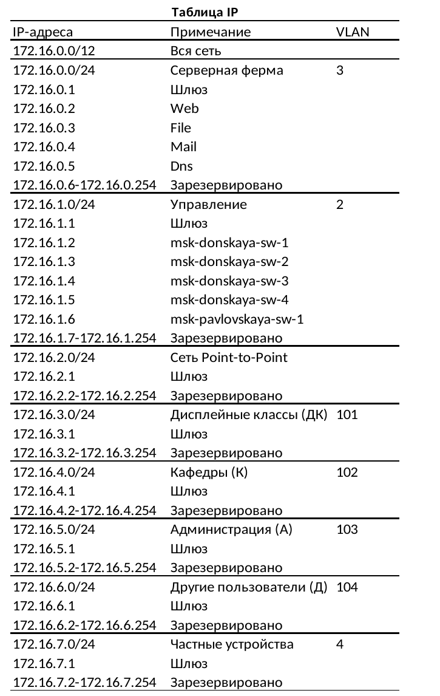

---
## Front matter
lang: ru-RU
title: Структура научной презентации
subtitle: Простейший шаблон
author:
  -  Абд эль хай М.
institute:
  - Российский университет дружбы народов, Москва, Россия
date: 07 марта 2024
mainfont: "Times New Roman" 
## i18n babel
babel-lang: russian
babel-otherlangs: english

## Formatting pdf
toc: false
toc-title: Содержание
slide_level: 2
aspectratio: 169
section-titles: true
theme: metropolis
header-includes:
 - \metroset{progressbar=frametitle,sectionpage=progressbar,numbering=fraction}
 - '\makeatletter'
 - '\beamer@ignorenonframefalse'
 - '\makeatother'
---

# Цель работы

Познакомится с принципами планирования локальной сети организации

# Задание

1. Используя графический редактор (например, Dia), требуется повторить схемы L1, L2, L3, а также сопутствующие им таблицы VLAN, IP-адресов и портов подключения оборудования планируемой сети.

2. Рассмотренный выше пример планирования адресного пространства сети базируется на разбиении сети 10.128.0.0/16 на соответствующие подсети. Требуется сделать аналогичный план адресного пространства для сетей 172.16.0.0/12 и 192.168.0.0/16 с соответствующими схемами сети и сопутствующими таблицами VLAN, IP-адресов и портов подключения оборудования.

2. При выполнении работы необходимо учитывать соглашение об именовании 

# Выполнение лабораторной работы

Схема планируемой сети с указанием типов и номеров портов подключения устройств, соответствующая физическому уровню модели OSI (L1), будет иметь вид, изображённый на рис 3.1.

{#fig:001 width=100%}

## Сеть1 Таблица портов

{#fig:002 width=100%}

## Сеть1 Диаграм l2

{#fig:003 width=100%}

## Сеть1 Таблица VLAN

{#fig:004 width=100%}

## Сеть1 Диаграм l3

{#fig:005 width=100%}

## Сеть1 Таблица IP

{#fig:006 width=100%}

## Сеть2 Диаграм l1

{#fig:007 width=100%}

## Сеть2 Таблица портов

{#fig:008 width=100%}

## Сеть2 Диаграм l2

{#fig:009 width=100%}
 
## Сеть2 Таблица VLAN

{#fig:010 width=100%}

## Сеть2 Диаграм l3

{#fig:011 width=100%}

## Сеть2 Таблица IP

{#fig:012 width=100%}

## Сеть3 Диаграм l1

{#fig:013 width=100%}

# Выводы

Здесь кратко описываются итоги проделанной работы.
