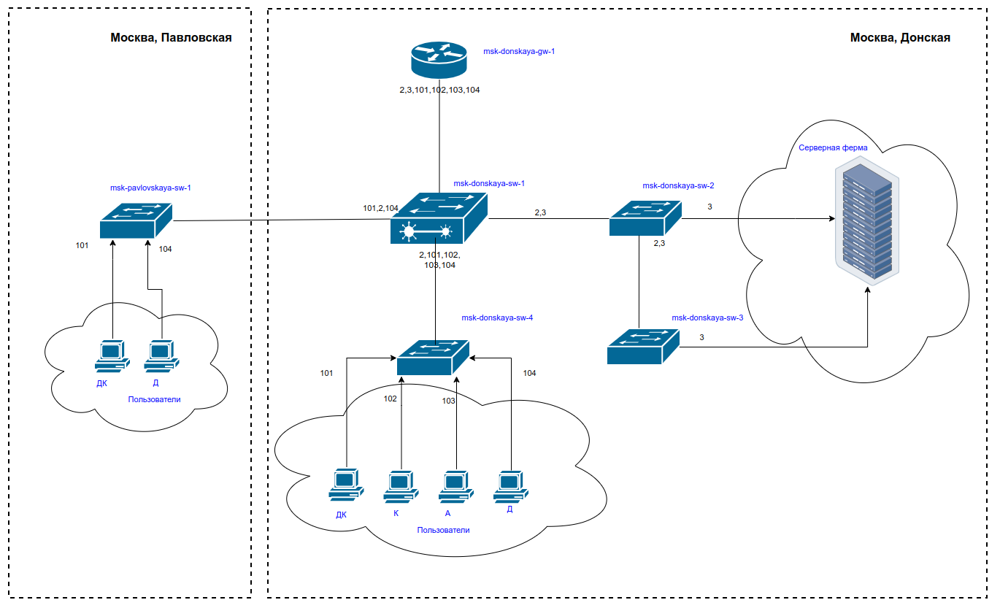
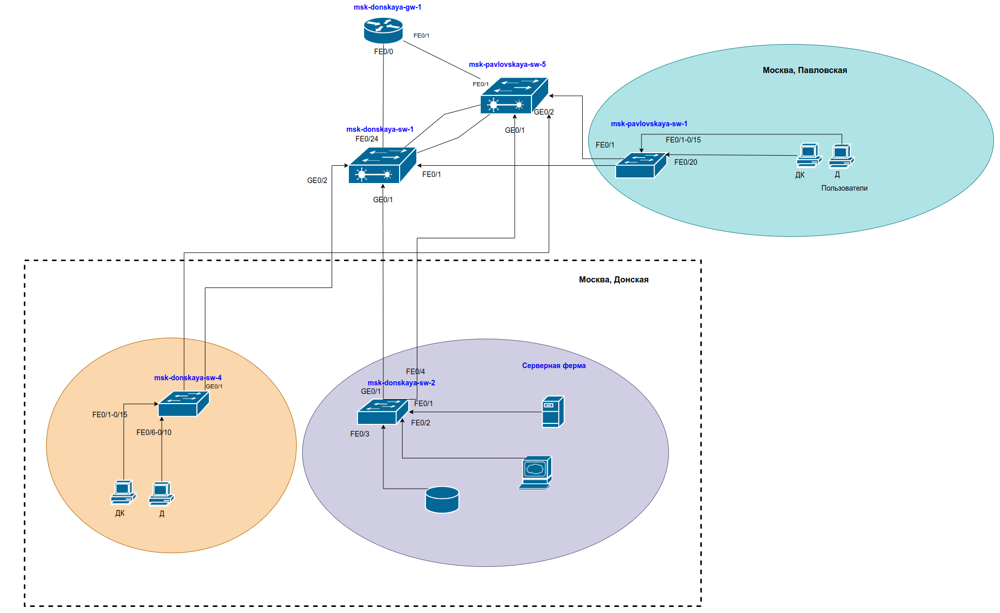

---
## Front matter
title: "Первоначальное конфигурирование сети"
subtitle: "Лабораторная работа № 4"
author: "Абд эль хай Мохамад"

## Generic otions
lang: ru-RU
toc-title: "Содержание"

## Bibliography
bibliography: bib/cite.bib
csl: pandoc/csl/gost-r-7-0-5-2008-numeric.csl

## Pdf output format
toc: true # Table of contents
toc-depth: 2
lof: true # List of figures
lot: false # List of tables
fontsize: 12pt
linestretch: 1.5
papersize: a4
documentclass: scrreprt
## I18n polyglossia
polyglossia-lang:
  name: russian
  options:
	- spelling=modern
	- babelshorthands=true
polyglossia-otherlangs:
  name: english
## I18n babel
babel-lang: russian
babel-otherlangs: english
## Fonts
mainfont: PT Serif
romanfont: PT Serif
sansfont: PT Sans
monofont: PT Mono
mainfontoptions: Ligatures=TeX
romanfontoptions: Ligatures=TeX
sansfontoptions: Ligatures=TeX,Scale=MatchLowercase
monofontoptions: Scale=MatchLowercase,Scale=0.9
## Biblatex
biblatex: true
biblio-style: "gost-numeric"
biblatexoptions:
  - parentracker=true
  - backend=biber
  - hyperref=auto
  - language=auto
  - autolang=other*
  - citestyle=gost-numeric
## Pandoc-crossref LaTeX customization
figureTitle: "Рис."
tableTitle: "Таблица"
listingTitle: "Листинг"
lofTitle: "Список иллюстраций"
lotTitle: "Список таблиц"
lolTitle: "Листинги"
## Misc options
indent: true
header-includes:
  - \usepackage{indentfirst}
  - \usepackage{float} # keep figures where there are in the text
  - \floatplacement{figure}{H} # keep figures where there are in the text
---

# Цель работы

Познакомится с принципами планирования локальной сети организации

# Задание

1. Используя графический редактор (например, Dia), требуется повторить схемы L1, L2, L3, а также сопутствующие им таблицы VLAN, IP-адресов и портов подключения оборудования планируемой сети.

2. Рассмотренный выше пример планирования адресного пространства сети базируется на разбиении сети 10.128.0.0/16 на соответствующие подсети. Требуется сделать аналогичный план адресного пространства для сетей 172.16.0.0/12 и 192.168.0.0/16 с соответствующими схемами сети и сопутствующими таблицами VLAN, IP-адресов и портов подключения оборудования.

2. При выполнении работы необходимо учитывать соглашение об именовании 

# Выполнение лабораторной работы

Схема планируемой сети с указанием типов и номеров портов подключения устройств, соответствующая физическому уровню модели OSI (L1), будет иметь вид, изображённый на рис 3.1.

{#fig:001 width=100%}

{#fig:002 width=100%}

{#fig:003 width=100%}

{#fig:004 width=100%}

{#fig:005 width=100%}

{#fig:006 width=100%}

{#fig:007 width=100%}

{#fig:008 width=100%}

{#fig:009 width=100%}

{#fig:010 width=100%}

{#fig:011 width=100%}

{#fig:012 width=100%}

{#fig:013 width=100%}

# Выводы

Здесь кратко описываются итоги проделанной работы.

# Контрольные вопросы

### Модель взаимодействия открытых систем (OSI)

- Модель OSI представляет собой концептуальную основу, которая стандартизирует функции телекоммуникационной или вычислительной системы на семь уровней абстракции.
- Модель OSI состоит из следующих уровней:
   - 7. Применение
   - 6. Презентация
   - 5. Сессия
   - 4. Транспорт
   - 3. Сеть
   - 2. Канал передачи данных
   - 1. Физический
   - 
- Функции, назначенные каждому слою, включают:
   - Приложение: службы сетевых приложений.
   - Презентация: Перевод, сжатие и шифрование.
   - Сеанс: управление диалогом
   - Транспорт: сквозные соединения и надежность.
   - Сеть: маршрутизация и адресация.
   - Канал передачи данных: передача данных между узлами.
   - Физический: передача и прием необработанных битовых потоков.

### Функции переключателя

- Коммутатор — это сетевое устройство, которое пересылает пакеты данных между устройствами в одной сети.
- Функции переключателя включают в себя:
   - Фильтрация и пересылка данных на основе MAC-адресов
   - Создание отдельных доменов коллизий
   - Увеличение общей производительности сети.

### Функции маршрутизатора

— Маршрутизатор — это сетевое устройство, которое пересылает пакеты данных между компьютерными сетями.
- В функции роутера входят:
   - Определение наилучшего пути передачи данных.
   - Пересылка данных на основе IP-адресов
   - Объединение нескольких сетей вместе

### Коммутаторы уровня 3 и уровня 2

— Основное различие между коммутаторами уровня 2 и уровня 3 заключается в том, что коммутаторы уровня 3 могут выполнять функции маршрутизации, тогда как коммутаторы уровня 2 работают на уровне канала передачи данных и выполняют только базовую коммутацию.

### Сетевой интерфейс

- Сетевой интерфейс — это точка соединения между компьютером и частной или общедоступной сетью.

### Сетевой порт

— Сетевой порт — это виртуальная конечная точка для связи в сети. Он связан с определенной сетевой службой или приложением.

### Технологии Ethernet

- Ethernet: стандарт для технологии локальной сети (LAN) с использованием коаксиального кабеля или витой пары.
- Fast Ethernet: стандарт Ethernet со скоростью 100 Мбит/с.
- Gigabit Ethernet: стандарт Ethernet со скоростью 1 Гбит/с.

### P-адрес и подсети

- IP-адрес: уникальный идентификатор устройства в сети. Адреса IPv4 представляют собой 32-битные числа.
- Сеть: совокупность взаимосвязанных устройств.
- Подсеть: логическое подразделение IP-сети.
- Маска подсети: определяет сетевую и хостовую части IP-адреса.
- Пример: разделение сети с IP-адресом 192.168.1.0 на две подсети, в каждой по 30 хостов, приведет к появлению адресов подсетей 192.168.1.0/27 и 192.168.1.32/27.

### VLAN (Виртуальная локальная сеть)

- VLAN: метод создания независимых логических сетей внутри физической сети.
- Используется для сегментации трафика, повышения безопасности и упрощения управления сетью.
- Преимущества включают повышенную безопасность, лучшее использование полосы пропускания и упрощенное управление сетью.

### Магистральный порт и порт доступа

- Магистральный порт: передает трафик для нескольких VLAN, используемых для соединения коммутаторов.
- Порт доступа: подключается к одной VLAN и используется для конечных устройств.