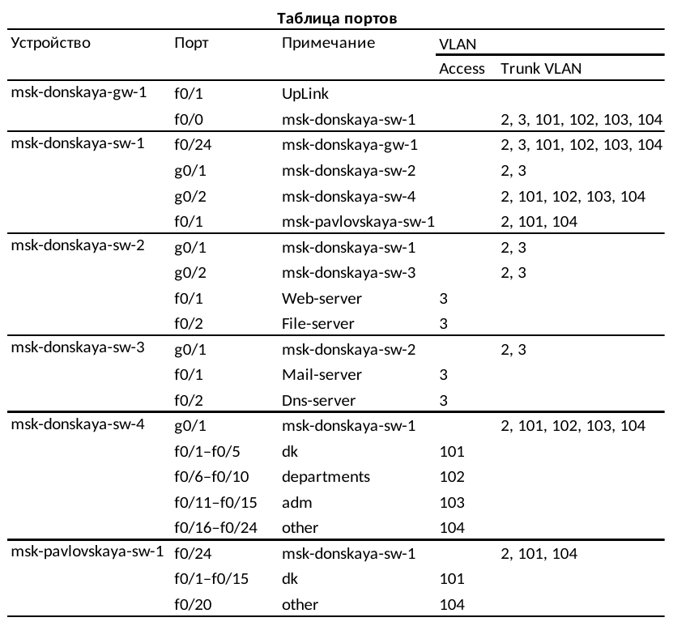
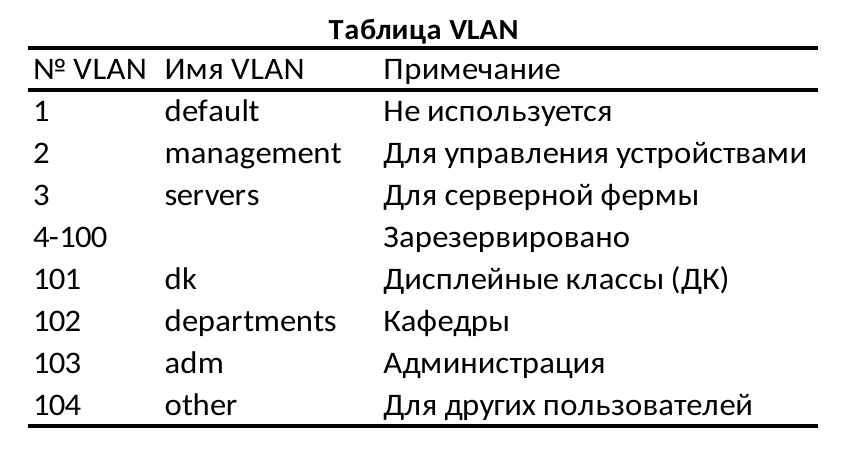
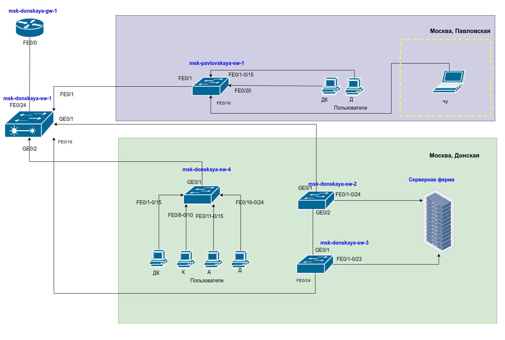

---
## Front matter
title: "Первоначальное конфигурирование сети"
subtitle: "Лабораторная работа № 4"
author: "Абд эль хай Мохамад"

## Generic otions
lang: ru-RU
toc-title: "Содержание"

## Bibliography
bibliography: bib/cite.bib
csl: pandoc/csl/gost-r-7-0-5-2008-numeric.csl

## Pdf output format
toc: true # Table of contents
toc-depth: 2
lof: true # List of figures
lot: false # List of tables
fontsize: 12pt
linestretch: 1.5
papersize: a4
documentclass: scrreprt
## I18n polyglossia
polyglossia-lang:
  name: russian
  options:
	- spelling=modern
	- babelshorthands=true
polyglossia-otherlangs:
  name: english
## I18n babel
babel-lang: russian
babel-otherlangs: english
## Fonts
mainfont: PT Serif
romanfont: PT Serif
sansfont: PT Sans
monofont: PT Mono
mainfontoptions: Ligatures=TeX
romanfontoptions: Ligatures=TeX
sansfontoptions: Ligatures=TeX,Scale=MatchLowercase
monofontoptions: Scale=MatchLowercase,Scale=0.9
## Biblatex
biblatex: true
biblio-style: "gost-numeric"
biblatexoptions:
  - parentracker=true
  - backend=biber
  - hyperref=auto
  - language=auto
  - autolang=other*
  - citestyle=gost-numeric
## Pandoc-crossref LaTeX customization
figureTitle: "Рис."
tableTitle: "Таблица"
listingTitle: "Листинг"
lofTitle: "Список иллюстраций"
lotTitle: "Список таблиц"
lolTitle: "Листинги"
## Misc options
indent: true
header-includes:
  - \usepackage{indentfirst}
  - \usepackage{float} # keep figures where there are in the text
  - \floatplacement{figure}{H} # keep figures where there are in the text
---

# Цель работы

Познакомится с принципами планирования локальной сети организации

# Задание

1. Используя графический редактор (например, Dia), требуется повторить схемы L1, L2, L3, а также сопутствующие им таблицы VLAN, IP-адресов и портов подключения оборудования планируемой сети.

2. Рассмотренный выше пример планирования адресного пространства сети базируется на разбиении сети 10.128.0.0/16 на соответствующие подсети. Требуется сделать аналогичный план адресного пространства для сетей 172.16.0.0/12 и 192.168.0.0/16 с соответствующими схемами сети и сопутствующими таблицами VLAN, IP-адресов и портов подключения оборудования.

2. При выполнении работы необходимо учитывать соглашение об именовании 

# Выполнение лабораторной работы

Схема планируемой сети с указанием типов и номеров портов подключения устройств, соответствующая физическому уровню модели OSI (L1), будет иметь вид, изображённый на рис 3.1.

{#fig:001 width=100%}

{#fig:002 width=100%}

{#fig:003 width=100%}

{#fig:004 width=100%}

{#fig:005 width=100%}

{#fig:006 width=100%}

{#fig:007 width=100%}

{#fig:008 width=100%}

{#fig:009 width=100%}

{#fig:010 width=100%}

{#fig:011 width=100%}

{#fig:012 width=100%}

{#fig:013 width=100%}

# Выводы

Здесь кратко описываются итоги проделанной работы.
