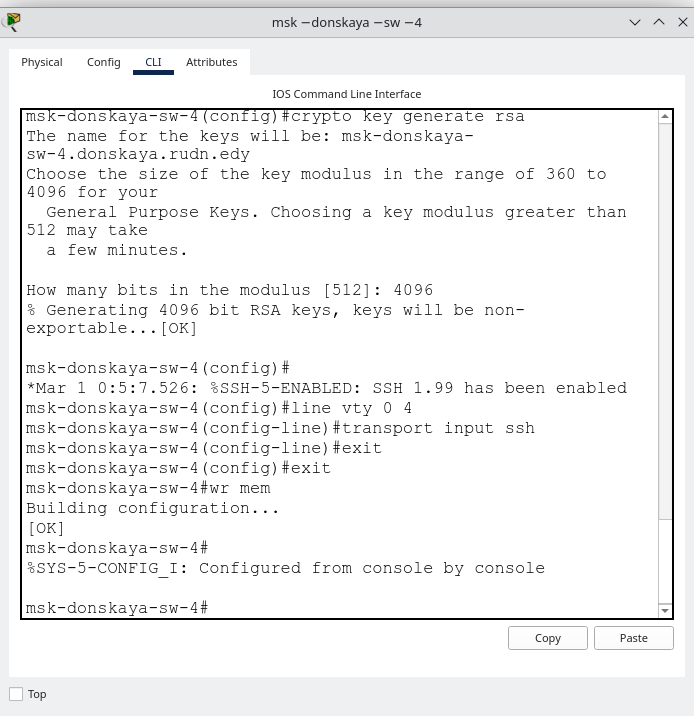
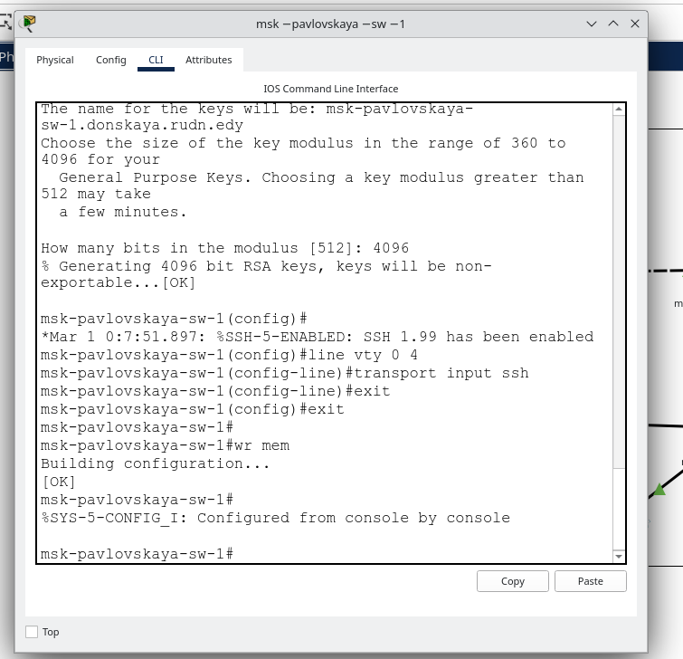

---
## Front matter
lang: ru-RU
title: Лабораторная работа № 2
subtitle: Предварительная настройка оборудования Cisco
author:
  - Абд эль хай М.
institute:
  - Российский университет дружбы народов, Москва, Россия
date: 09 марта 2024
mainfont: "Times New Roman" 
## i18n babel
babel-lang: russian
babel-otherlangs: english

## Formatting pdf
toc: false
toc-title: Содержание
slide_level: 2
aspectratio: 169
section-titles: true
theme: metropolis
header-includes:
 - \metroset{progressbar=frametitle,sectionpage=progressbar,numbering=fraction}
 - '\makeatletter'
 - '\beamer@ignorenonframefalse'
 - '\makeatother'
---

# Цель работы

Провести подготовительную работу по первоначальной настройке коммутаторов сети.

# Задание

Требуется сделать первоначальную настройку коммутаторов сети, представленной на схеме L1. Под первоначальной настройкой понимается указание имени устройства, его IP-адреса, настройка доступа по паролю к виртуальным терминалам и консоли, настройка удалённого доступа к устройству по ssh.

# Выполнение лабораторной работы

{#fig:001 width=100%}

# Выполнение лабораторной работы

{#fig:002 width=100%}

# Выполнение лабораторной работы

{#fig:003 width=100%}

# Выполнение лабораторной работы

{#fig:004 width=100%}

# Выводы

Научился настраивать коммутаторы в сети.