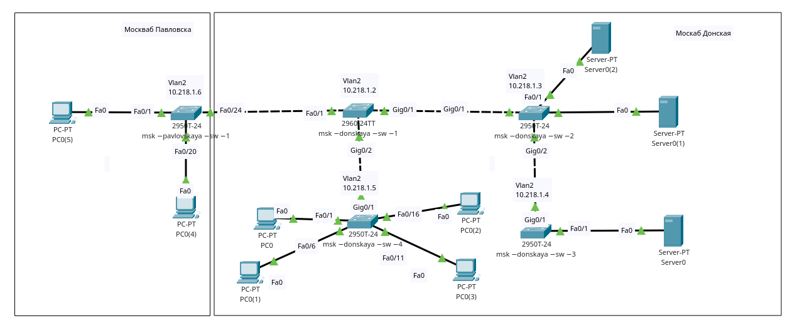
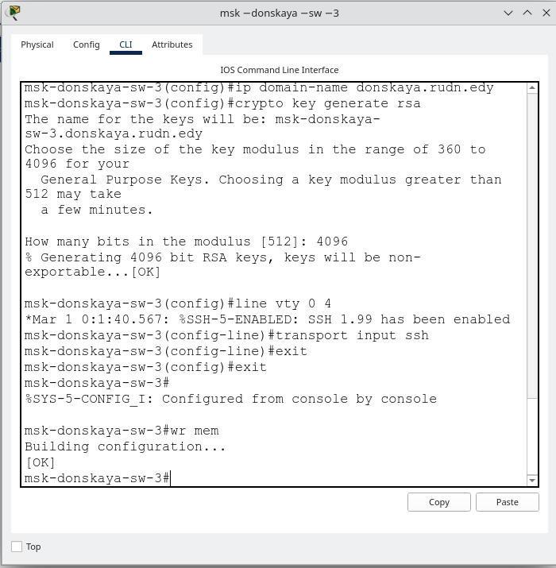
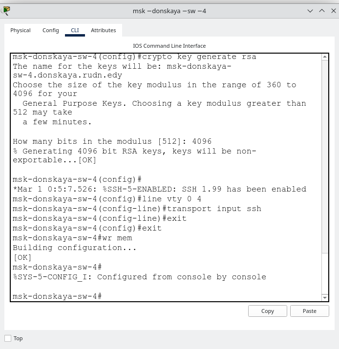

---
## Front matter
title: "Первоначальное конфигурирование сети"
subtitle: "Лабораторная работа № 4"
author: "Абд эль хай Мохамад"

## Generic otions
lang: ru-RU
toc-title: "Содержание"

## Bibliography
bibliography: bib/cite.bib
csl: pandoc/csl/gost-r-7-0-5-2008-numeric.csl

## Pdf output format
toc: true # Table of contents
toc-depth: 2
lof: true # List of figures
lot: false # List of tables
fontsize: 12pt
linestretch: 1.5
papersize: a4
documentclass: scrreprt
## I18n polyglossia
polyglossia-lang:
  name: russian
  options:
	- spelling=modern
	- babelshorthands=true
polyglossia-otherlangs:
  name: english
## I18n babel
babel-lang: russian
babel-otherlangs: english
## Fonts
mainfont: PT Serif
romanfont: PT Serif
sansfont: PT Sans
monofont: PT Mono
mainfontoptions: Ligatures=TeX
romanfontoptions: Ligatures=TeX
sansfontoptions: Ligatures=TeX,Scale=MatchLowercase
monofontoptions: Scale=MatchLowercase,Scale=0.9
## Biblatex
biblatex: true
biblio-style: "gost-numeric"
biblatexoptions:
  - parentracker=true
  - backend=biber
  - hyperref=auto
  - language=auto
  - autolang=other*
  - citestyle=gost-numeric
## Pandoc-crossref LaTeX customization
figureTitle: "Рис."
tableTitle: "Таблица"
listingTitle: "Листинг"
lofTitle: "Список иллюстраций"
lotTitle: "Список таблиц"
lolTitle: "Листинги"
## Misc options
indent: true
header-includes:
  - \usepackage{indentfirst}
  - \usepackage{float} # keep figures where there are in the text
  - \floatplacement{figure}{H} # keep figures where there are in the text
---

# Цель работы

Провести подготовительную работу по первоначальной настройке коммутаторов сети.

# Задание

Требуется сделать первоначальную настройку коммутаторов сети, представленной на схеме L1. Под первоначальной настройкой понимается указание имени устройства, его IP-адреса, настройка доступа по паролю к виртуальным терминалам и консоли, настройка удалённого доступа к устройству по ssh.

# Выполнение лабораторной работы

Сначала я создал сеть на логической вкладке. Я использовал 6 конечных устройств, 5 коммутаторов и 3 сервера. Затем я подключил устройства.

{#fig:001 width=100%}

Я указал IP и VLAN для коммутаторов.

{#fig:002 width=100%}

{#fig:003 width=100%}

Конфигурация включает в себя настройку уникальных имен хостов для каждого коммутатора, настройку интерфейсов VLAN с IP-адресами, настройку шлюза по умолчанию, повышение безопасности за счет шифрования паролей, создание пользователя с правами администратора, настройку имени домена, генерацию ключей шифрования RSA, включение SSH для безопасного доступа. и сохраняем конфигурации.

{#fig:004 width=100%}

Команды для настройки коммутаторов в этой сети были одинаковыми. Изменение имени хоста, установка IP, пароля и прочего..

```bash
en
conf t

#change
hostname msk-donskaya-sw-1


interface vlan2
no shutdown

# change
ip address 10.128.1.2 255.255.255.0

exit

ip default-gateway 10.128.1.1
line vty 0 4
password cisco
login
exit
enable secret cisco
service password-encryption
username admin privilege 1 secret cisco
ip domain-name donskaya.rudn.edy
crypto key generate rsa

line vty 0 4
transport input ssh
exit
exit

wr mem
```

Помимо имени хоста и IP-адреса, я использовал приведенный выше сценарий для всех 5 коммутаторов.


# Выводы

Научился настраивать коммутаторы в сети.
