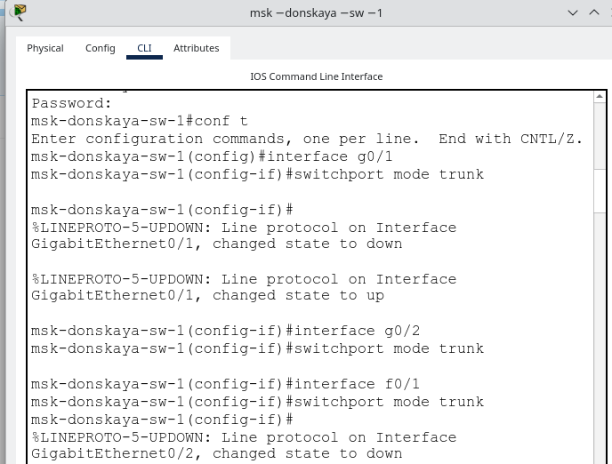
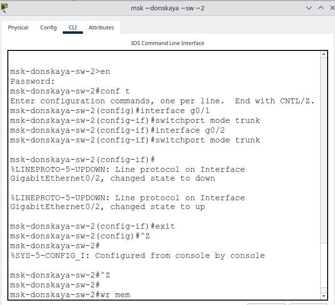
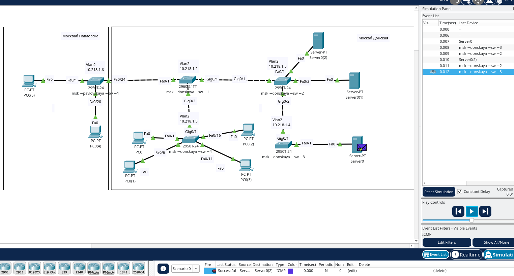
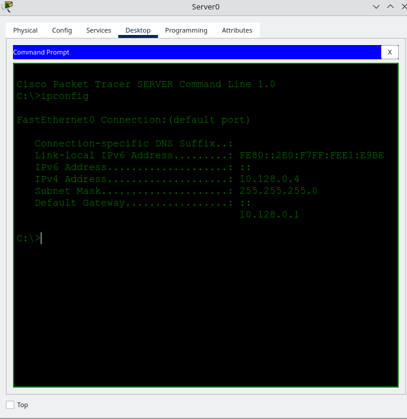

---
## Front matter
lang: ru-RU
title: Лабораторная работа № 5
subtitle: Конфигурирование VLAN
author:
  - Абд эль хай М.
institute:
  - Российский университет дружбы народов, Москва, Россия
date: 12 марта 2024
mainfont: "Times New Roman" 
## i18n babel
babel-lang: russian
babel-otherlangs: english

## Formatting pdf
toc: false
toc-title: Содержание
slide_level: 2
aspectratio: 169
section-titles: true
theme: metropolis
header-includes:
 - \metroset{progressbar=frametitle,sectionpage=progressbar,numbering=fraction}
 - '\makeatletter'
 - '\beamer@ignorenonframefalse'
 - '\makeatother'
---

# Цель работы

Получить основные навыки по настройке VLAN на коммутаторах сети.

# Задание

1. На коммутаторах сети настроить Trunk-порты на соответствующих интерфейсах (см. табл. 3.2 из раздела 3.3), связывающих коммутаторы между собой.
2. Коммутатор msk-donskaya-sw-1 настроить как VTP-сервер и прописать на нём номера и названия VLAN согласно табл. 3.1 из раздела 3.3.
3. Коммутаторы msk-donskaya-sw-2 — msk-donskaya-sw-4, msk-pavlovskaya-sw-1 настроить как VTP-клиенты, на интерфейсах указать принадлежность к соответствующему VLAN (см. табл. 3.3 из раздела 3.3).
4. На серверах прописать IP-адреса, как указано в табл. 3.2 из раздела 3.3.
5. На оконечных устройствах указать соответствующий адрес шлюза и прописать статические IP-адреса из диапазона соответствующей сети, следуя регламенту выделения ip-адресов (см. табл. 3.4 из раздела 3.3).
6. Проверить доступность устройств, принадлежащих одному VLAN, и недоступность устройств, принадлежащих разным VLAN.
7. При выполнении работы необходимо учитывать соглашение об именовании.

# Выполнение лабораторной работы

## Конфигурация Trunk-порта

{#fig:001 width=100%}

## Конфигурация Trunk-порта

{#fig:002 width=100%}

## Конфигурация Trunk-порта

{#fig:003 width=100%}

## Конфигурация VLAN

{#fig:004 width=100%}

## Конфигурация VLAN

{#fig:005 width=100%}

## Конфигурация VTP

{#fig:006 width=100%}

## Конфигурация диапазона портов

{#fig:007 width=100%}

## Конфигурация диапазона портов

{#fig:008 width=100%}

## Тестирование с помощью ping

{#fig:009 width=100%}

## Тестирование с помощью ping

{#fig:010 width=100%}

## IP-адреса

{#fig:011 width=100%}

## IP-адреса

{#fig:012 width=100%}

# Выводы

Научился настраивать VLAN в сети. Я также узнал о магистральных портах, портах доступа и VTP.