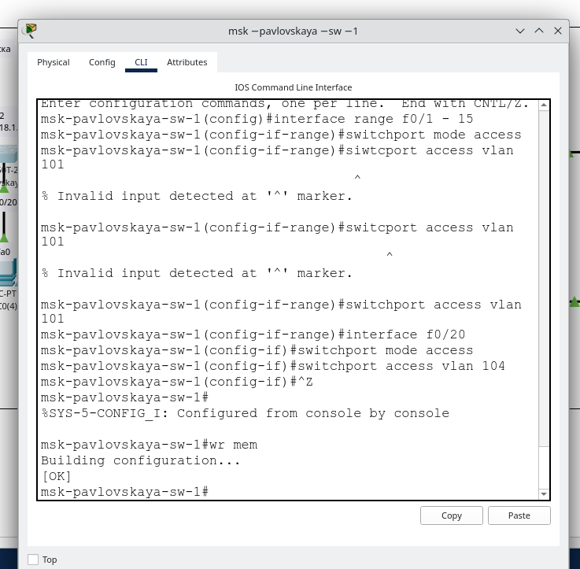

---
## Front matter
title: "Конфигурирование VLAN"
subtitle: "Лабораторная работа № 5"
author: "Абд эль хай Мохамад"

## Generic otions
lang: ru-RU
toc-title: "Содержание"

## Bibliography
bibliography: bib/cite.bib
csl: pandoc/csl/gost-r-7-0-5-2008-numeric.csl

## Pdf output format
toc: true # Table of contents
toc-depth: 2
lof: true # List of figures
lot: false # List of tables
fontsize: 12pt
linestretch: 1.5
papersize: a4
documentclass: scrreprt
## I18n polyglossia
polyglossia-lang:
  name: russian
  options:
	- spelling=modern
	- babelshorthands=true
polyglossia-otherlangs:
  name: english
## I18n babel
babel-lang: russian
babel-otherlangs: english
## Fonts
mainfont: PT Serif
romanfont: PT Serif
sansfont: PT Sans
monofont: PT Mono
mainfontoptions: Ligatures=TeX
romanfontoptions: Ligatures=TeX
sansfontoptions: Ligatures=TeX,Scale=MatchLowercase
monofontoptions: Scale=MatchLowercase,Scale=0.9
## Biblatex
biblatex: true
biblio-style: "gost-numeric"
biblatexoptions:
  - parentracker=true
  - backend=biber
  - hyperref=auto
  - language=auto
  - autolang=other*
  - citestyle=gost-numeric
## Pandoc-crossref LaTeX customization
figureTitle: "Рис."
tableTitle: "Таблица"
listingTitle: "Листинг"
lofTitle: "Список иллюстраций"
lotTitle: "Список таблиц"
lolTitle: "Листинги"
## Misc options
indent: true
header-includes:
  - \usepackage{indentfirst}
  - \usepackage{float} # keep figures where there are in the text
  - \floatplacement{figure}{H} # keep figures where there are in the text
---

# Цель работы

Получить основные навыки по настройке VLAN на коммутаторах сети.

# Задание

1. На коммутаторах сети настроить Trunk-порты на соответствующих интерфейсах (см. табл. 3.2 из раздела 3.3), связывающих коммутаторы между собой.
2. Коммутатор msk-donskaya-sw-1 настроить как VTP-сервер и прописать на нём номера и названия VLAN согласно табл. 3.1 из раздела 3.3.
3. Коммутаторы msk-donskaya-sw-2 — msk-donskaya-sw-4, msk-pavlovskaya-sw-1 настроить как VTP-клиенты, на интерфейсах указать принадлежность к соответствующему VLAN (см. табл. 3.3 из раздела 3.3).
4. На серверах прописать IP-адреса, как указано в табл. 3.2 из раздела 3.3.
5. На оконечных устройствах указать соответствующий адрес шлюза и прописать статические IP-адреса из диапазона соответствующей сети, следуя регламенту выделения ip-адресов (см. табл. 3.4 из раздела 3.3).
6. Проверить доступность устройств, принадлежащих одному VLAN, и недоступность устройств, принадлежащих разным VLAN.
7. При выполнении работы необходимо учитывать соглашение об именовании.

# Выполнение лабораторной работы


## Конфигурация Trunk-порта

Я начал настраивать trunk порт для каждого коммутатора. Например, коммутатор msk-donakaya-sw-1 имеет 3 mqk порта. trunk порт позволяет передавать данные через сетевой узел для нескольких VLAN.

{#fig:001 width=100%}

После переключения в режим конфигурации в командной строке коммутатора я начал с указания интерфейса, который хочу редактировать, с помощью команды `interface g0/1`.

Затем я переключаю режим порта в транке, используя `switchport mode Trunk`

{#fig:002 width=100%}

{#fig:003 width=100%}

## Конфигурация VLAN

В командной строке коммутатора я начал с указания номера VLAN, а затем изменил его имя. Таким образом, я смог назвать VLAN для одного коммутатора.

Этого хватит для одного коммутаторая. Мне все еще нужно вручную выполнить этот процесс на каждом коммутаторае. Вместо этого я использил VTP, протокол для распространения определения VLAN по всей локальной сети.

{#fig:004 width=100%}

{#fig:005 width=100%}

## Конфигурация VTP

Коммутатор, на котором у меня был список VLAN, я настроил его как сервер. Это означает, что мне нужно будет настроить другие коммутаторы в качестве клиентов.

{#fig:006 width=100%}

## Конфигурация диапазона портов

Порты, связанные с VLAN. Устройства, подключенные к этим портам, получат доступ к VLAN, которой назначен порт.

{#fig:007 width=100%}

{#fig:008 width=100%}

## Тестирование с помощью ping
{#fig:009 width=100%}

{#fig:010 width=100%}

## IP-адреса
{#fig:011 width=100%}

{#fig:012 width=100%}


# Выводы

Научился настраивать VLAN в сети. Я также узнал о trunk портах, портах доступа и VTP.

# Контрольные вопросы

## Просмотр списка VLAN на сетевом устройстве

Чтобы просмотреть список VLAN на сетевом устройстве, можно использовать следующую команду:

``` bash

показать Влан
```
Эта команда предоставляет список всех сетей VLAN, настроенных на сетевом устройстве, а также их соответствующие сведения.

## Транкинговый протокол VLAN (VTP)

VLAN Trunking Protocol (VTP) — это собственный протокол Cisco, который управляет добавлением, удалением и переименованием VLAN в масштабе всей сети. Это уменьшает необходимость настройки одной и той же информации VLAN на каждом коммутаторе отдельно.

### Команды для настройки и просмотра информации о VLAN

- Включить VTP на коммутаторе

``` bash

режим vtp {сервер | клиент | прозрачный}
```
 

Эта команда устанавливает режим VTP для коммутатора, который может быть серверным, клиентским или прозрачным.

- Настроить домен VTP

``` bash

vtp-домен имя_домена

  ```

Эта команда устанавливает имя домена VTP.

- Просмотр информации VTP

``` bash

показать статус vtp
```
 

Эта команда отображает конфигурацию и информацию о состоянии VTP.

## Протокол управляющих сообщений Интернета (ICMP)

ICMP — это протокол сетевого уровня, используемый для отправки сообщений об ошибках и оперативной информации, указывающей, например, что запрошенная услуга недоступна или что хост или маршрутизатор не могут быть достигнуты.
Формат ICMP-пакета

- Тип
- Код
- Контрольная сумма
- Остальная часть заголовка
- Данные

## Протокол разрешения адресов (ARP)

ARP используется для сопоставления IP-адреса с адресом физического компьютера, который распознается в локальной сети. Это важно для функционирования Интернет-протокола (IP).

### Формат ARP-пакета

Тип оборудования
Тип протокола
HLEN (длина аппаратного адреса)
PLEN (длина адреса протокола)
Операция
Аппаратный адрес отправителя
Протокольный адрес отправителя
Целевой аппаратный адрес
Адрес целевого протокола

## MAC-адрес

MAC-адрес (управление доступом к среде передачи) — это уникальный идентификатор, назначаемый сетевым интерфейсам для связи в физическом сегменте сети. Он используется для большинства сетевых технологий и часто представляется в виде 12-значного шестнадцатеричного числа.

### Структура MAC-адреса

- Первые 6 цифр: уникальный идентификатор организации (OUI).
- Последние 6 цифр: серийный номер устройства.

OUI назначается IEEE и однозначно идентифицирует производителя сетевой карты или устройства.