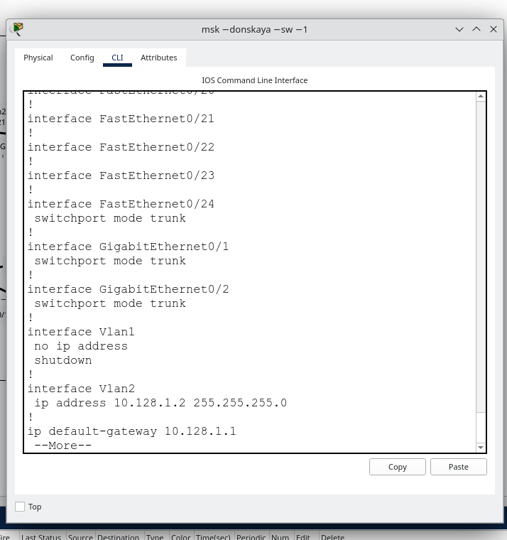
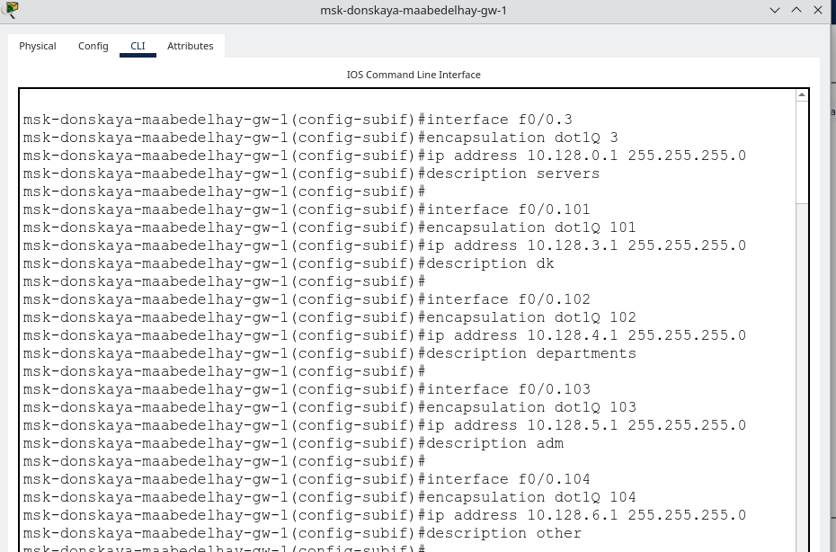
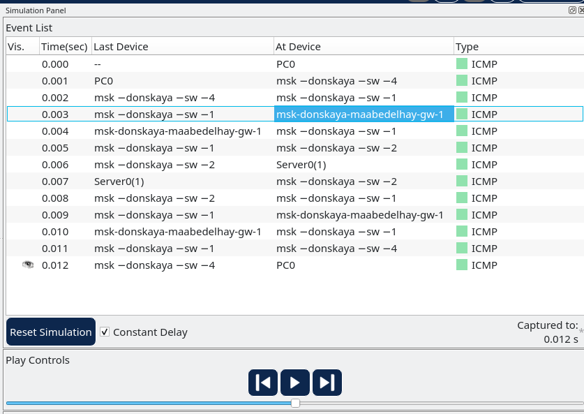

---
## Front matter
lang: ru-RU
title: Лабораторная работа № 6
subtitle: Статическая маршрутизация VLAN
author:
  - Абд эль хай М.
institute:
  - Российский университет дружбы народов, Москва, Россия
date: 21 марта 2024
mainfont: "Times New Roman" 
## i18n babel
babel-lang: russian
babel-otherlangs: english

## Formatting pdf
toc: false
toc-title: Содержание
slide_level: 2
aspectratio: 169
section-titles: true
theme: metropolis
header-includes:
 - \metroset{progressbar=frametitle,sectionpage=progressbar,numbering=fraction}
 - '\makeatletter'
 - '\beamer@ignorenonframefalse'
 - '\makeatother'
---

# Цель работы

Настроить статическую маршрутизацию VLAN в сети

# Задание

1. Добавить в локальную сеть маршрутизатор, провести его первоначальную настройку.
2. Настроить статическую маршрутизацию VLAN.
3. При выполнении работы необходимо учитывать соглашение об именовании.

# Выполнение лабораторной работы

## Выполнение лабораторной работы

{#fig:001 width=100%}

## Выполнение лабораторной работы

{#fig:002 width=100%}

## Выполнение лабораторной работы

{#fig:003 width=100%}

## Выполнение лабораторной работы

{#fig:004 width=100%}

## Выполнение лабораторной работы

{#fig:005 width=100%}

# Выводы

Научились настраивать статическую маршрутизацию VLAN в сети.