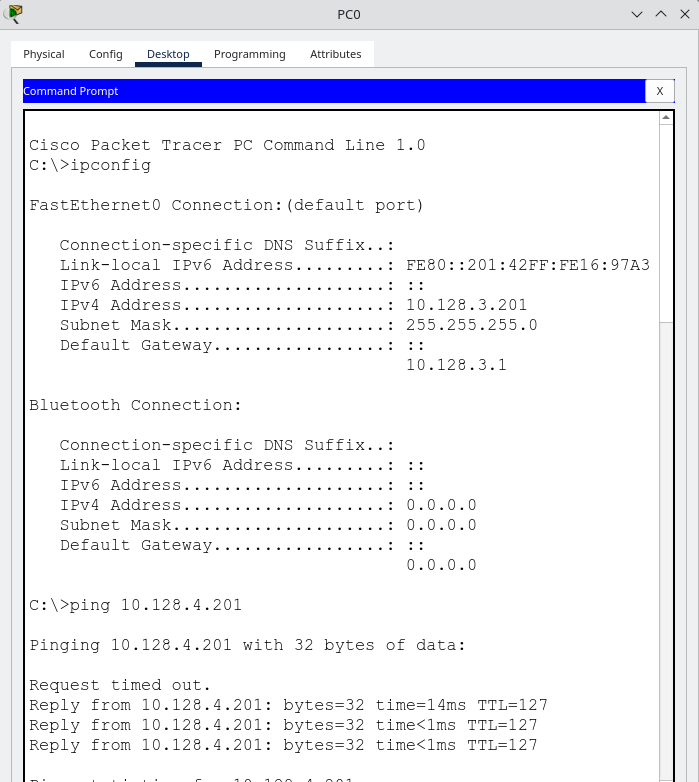

---
## Front matter
title: "Статическая маршрутизация VLAN"
subtitle: "Лабораторная работа № 6"
author: "Абд эль хай Мохамад"

## Generic otions
lang: ru-RU
toc-title: "Содержание"

## Bibliography
bibliography: bib/cite.bib
csl: pandoc/csl/gost-r-7-0-5-2008-numeric.csl

## Pdf output format
toc: true # Table of contents
toc-depth: 2
lof: true # List of figures
lot: true # List of tables
fontsize: 12pt
linestretch: 1.5
papersize: a4
documentclass: scrreprt
## I18n polyglossia
polyglossia-lang:
  name: russian
  options:
	- spelling=modern
	- babelshorthands=true
polyglossia-otherlangs:
  name: english
## I18n babel
babel-lang: russian
babel-otherlangs: english
## Fonts
mainfont: PT Serif
romanfont: PT Serif
sansfont: PT Sans
monofont: PT Mono
mainfontoptions: Ligatures=TeX
romanfontoptions: Ligatures=TeX
sansfontoptions: Ligatures=TeX,Scale=MatchLowercase
monofontoptions: Scale=MatchLowercase,Scale=0.9
## Biblatex
biblatex: true
biblio-style: "gost-numeric"
biblatexoptions:
  - parentracker=true
  - backend=biber
  - hyperref=auto
  - language=auto
  - autolang=other*
  - citestyle=gost-numeric
## Pandoc-crossref LaTeX customization
figureTitle: "Рис."
tableTitle: "Таблица"
listingTitle: "Листинг"
lofTitle: "Список иллюстраций"
lotTitle: "Список таблиц"
lolTitle: "Листинги"
## Misc options
indent: true
header-includes:
  - \usepackage{indentfirst}
  - \usepackage{float} # keep figures where there are in the text
  - \floatplacement{figure}{H} # keep figures where there are in the text
---

# Цель работы

Настроить статическую маршрутизацию VLAN в сети

# Задание

1. Добавить в локальную сеть маршрутизатор, провести его первоначальную настройку.
2. Настроить статическую маршрутизацию VLAN.
3. При выполнении работы необходимо учитывать соглашение об именовании.

# Выполнение лабораторной работы

{#fig:001 width=100%}

{#fig:002 width=100%}

{#fig:003 width=100%}

{#fig:004 width=100%}

{#fig:005 width=100%}

# Выводы

Научились настраивать статическую маршрутизацию VLAN в сети.

# Контрольные вопросы

1. Стандарт IEEE 802.1Q, фундаментальная часть сетей Ethernet, вводит концепцию маркировки VLAN. Он позволяет создавать виртуальные локальные сети (VLAN), обеспечивая логическую сегментацию одной физической сети на несколько изолированных виртуальных сетей. Такая сегментация повышает безопасность сети, оптимизирует поток трафика и упрощает управление сетью. Теги IEEE 802.1Q облегчают интеграцию нескольких сетевых устройств и обеспечивают гибкость при проектировании сложных сетевых топологий, сохраняя при этом эффективность сети.

2. Формат кадра IEEE 802.1Q предполагает добавление 32-битного тега VLAN к стандартному кадру Ethernet. Этот тег включает 16-битный идентификатор VLAN, позволяющий идентифицировать до 4096 различных VLAN. Тег VLAN также включает информацию о приоритете, облегчающую определение приоритетов качества обслуживания (QoS). Вставляя этот тег между исходным MAC-адресом и полем типа/длины Ethernet в кадре, тегирование IEEE 802.1Q позволяет коммутаторам и маршрутизаторам соответствующим образом обрабатывать и пересылать трафик на основе членства в VLAN, обеспечивая эффективную и безопасную связь в сложных сетевых средах.